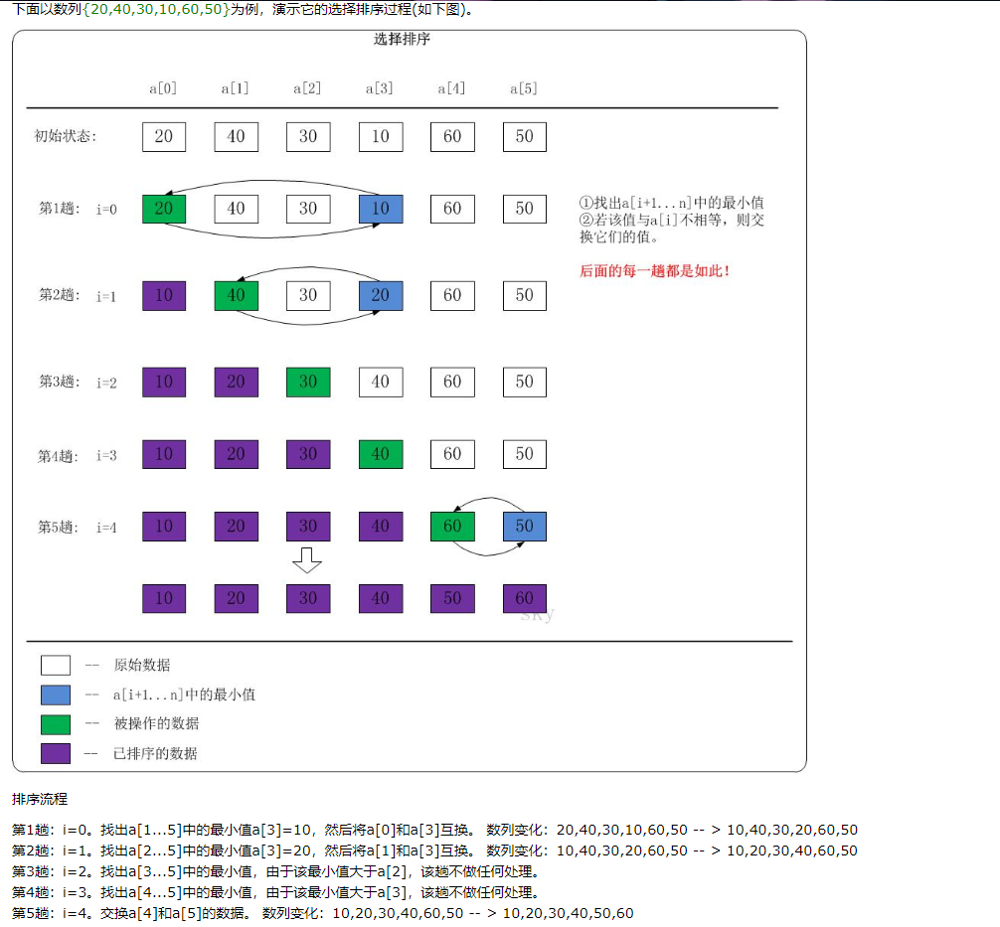

### 1.3 Python 选择排序

#### 1.3.1 概述

选择排序（Selection Sort）通过在待排序的部分查找最小元素（按升序排序）对数组进行排序，并将其放在序列开头，直到全部元素排序完毕。选择排序是一种不稳定的排序方法。
 
选择排序是一种简单直观的排序算法，无论什么数据进去都是 O(n²) 的时间复杂度。所以用到它的时候，数据规模越小越好。唯一的好处可能就是不占用额外的内存空间了吧。
 
选择排序对连个子序列进行操作：
 + 已经排好序的序列
 + 未排好序的剩余序列
 
#### 1.3.2 算法描述
```text
//SELECTION-SORT(A)                         执行次数
for j = 1 to Length(A)                         n
    i = j                                      n
    key = A(i)                                 n  
    for i to Lenth(A)                        n(n+1)/2
        if key>A(i)                            ...
            key = A(i)                         ...
            k = i                              ...
    A(k) = A(j)                                ...
    A(j)  = key                                ...
 
   所以 run time is O(n*n)
```
#### 1.3.3 语言描述
选择排序也是一种简单直观的排序算法。它的工作原理很容易理解：初始时在序列中找到最小（大）元素，放到序列的起始位置作为已排序序列；然后，再从剩余未排序元素中继续寻找最小（大）元素，放到已排序序列的末尾。以此类推，直到所有元素均排序完毕。

**【注意】** 选择排序与冒泡排序的区别：冒泡排序通过依次交换相邻两个顺序不合法的元素位置，从而将当前最小（大）元素放到合适的位置；而选择排序每遍历一次都记住了当前最小（大）元素的位置，最后仅需一次交换操作即可将其放到合适的位置。

#### 1.3.4 Example

##### 选择排序图示



##### 选择排序动态图示


#### 语言描述

对一待排序数组 arr[] = [64 25 12 22 11]

 (1)先找出 arr [0...4] 中的最小元素放置开头
 （**11** 25 12 22 64）
 
 (2)先找出 arr [1...4] 中的最小元素放置开头
 （11 **12** 25 22 64）
 
 (3)先找出 arr [2...4] 中的最小元素放置开头
 （11 12 **22** 25 64）
 
 (4)先找出 arr [3...4] 中的最小元素放置开头
 （11 12 22 **25** 64）
 
#### 1.3.5 算法实现

Python 实现
```
#!/usr/bin/env python
# Python 实现选择排序


def selection_sort(arr):
    n = len(arr)
    if n <= 1:
        return
    for i in range(n):
        min_idx = i
        for j in range(i+1, n):
            if arr[min_idx] > arr[j]:
                min_idx = j
        arr[i], arr[min_idx] = arr[min_idx], arr[i]
    return arr

```
C++ 实现
```
void selectionSort(int arr[], int n){
    for(int i=0; i<n; i++){
	int minIndex = i;
	    for(int j=i+1; j<n; j++){
		    if(arr[j] < arr[minIndex])
			    minIndex = j;
		}
	swap(arr[i], arr[minIndex]);
	}
}
```
