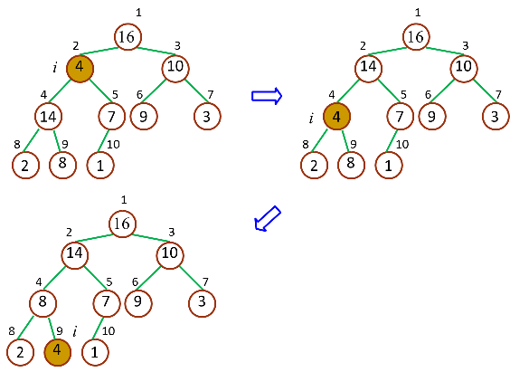
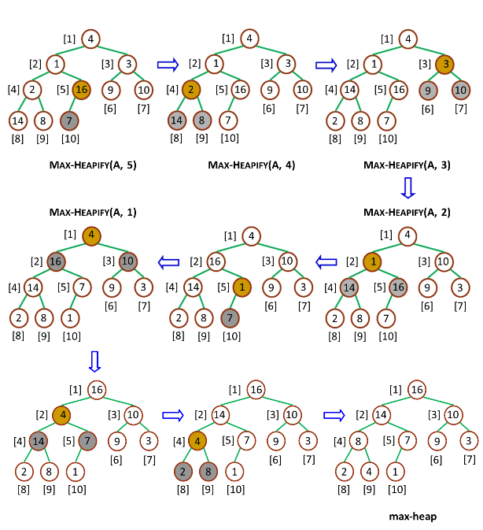
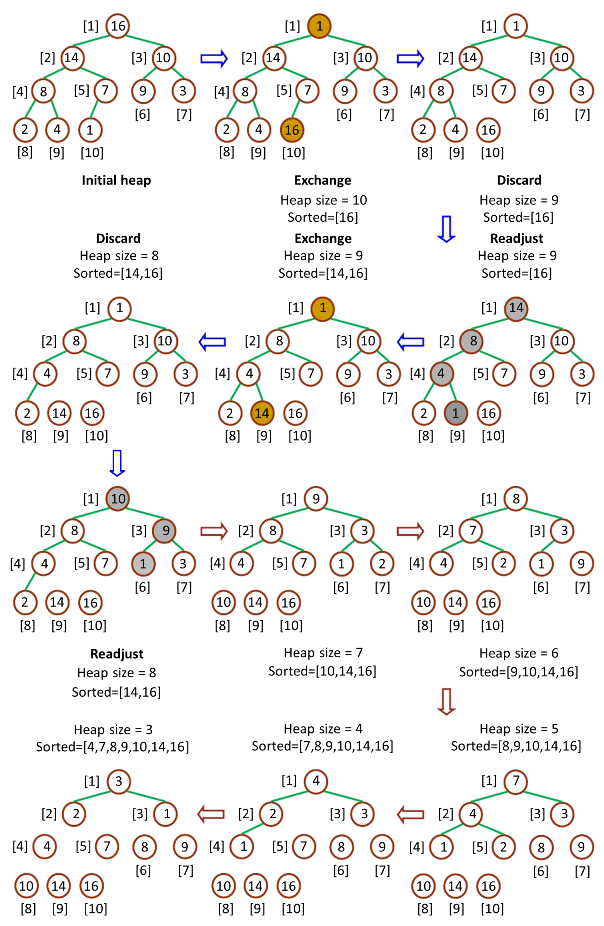
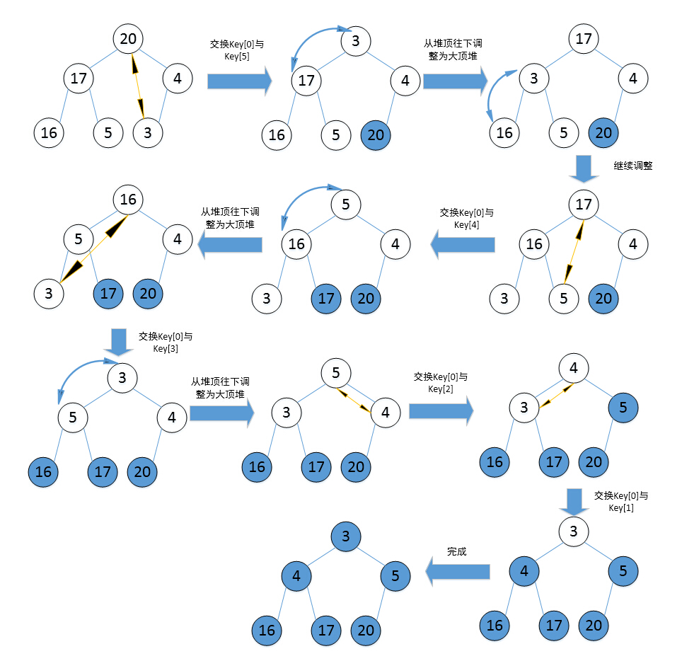

# Python 实现堆排序
## 一、基本思想

### 1.1 基本概念

堆是通过构造二叉堆（binary heap）实现的，实为二叉树的一种。堆（二叉堆）可以视为一棵完全的二叉树，完全二叉树的一个“优秀”的性质是，除了最底层之外，每一层都是满的，这使得堆可以利用数组来表示（普通的一般的二叉树通常用链表作为基本容器表示），每一个结点对应数组中的一个元素。

**堆跟数组的对应的关系**


### 1.2 基本要素
#### 1.2.1 节点要素
对于给定的某个结点的下标 i，可以很容易的计算出这个结点的父结点、孩子结点的下标：

+ Parent(i) = floor(i/2)，i 的父节点下标
+ Left(i) = 2i，i 的左子节点下标
+ Right(i) = 2i + 1，i 的右子节点下标


##### 1.2.2 最大堆与最小堆

二叉堆一般分为两种：最大堆和最小堆。


**最大堆**
+ 最大堆中的最大元素值出现在根结点（堆顶）
+ 堆中每个父节点的元素值都大于等于其孩子结点（如果存在）


**最小堆**

+ 最小堆中的最小元素值出现在根结点（堆顶）
+ 堆中每个父节点的元素值都小于等于其孩子结点（如果存在）


**堆排序**

堆排序（Heapsort）是指利用堆这种数据结构所设计的一种排序算法 。

通常堆是通过一维数组来实现的。在数组起始位置为0的情形中：

+ 父节点i的左子节点在位置(2*i+1);
+ 父节点i的右子节点在位置(2*i+2);
+ 子节点i的父节点在位置floor((i-1)/2);

在堆的数据结构中，堆中的最大值总是位于根节点。堆中定义以下几种操作：

+ 最大堆调整（Max_Heapify）：将堆的末端子节点作调整，使得子节点永远小于父节点
+ 创建最大堆（Build_Max_Heap）：将堆所有数据重新排序
+ 堆排序（HeapSort）：移除位在第一个数据的根节点，并做最大堆调整的递归运算

##### 1.2.3 最大调整堆(Max-Heapify)
作用是保持最大堆的性质，是创建最大堆的核心子程序，作用过程如图所示：


由于一次调整后，堆仍然违反堆性质，所以需要递归的测试，使得整个堆都满足堆性质。
递归调用需要压栈/清栈，和迭代相比，性能上有略微的劣势 。


##### 1.2.4 创建最大堆（Build Max Heap)

是将一个数组改造成一个最大堆，自下而上的调用 Max-Heapify 来改造数组，建立最大堆。因为 Max-Heapify 能够保证下标 i 的结点之后结点都满足最大堆的性质，所以自下而上的调用 Max-Heapify 能够在改造过程中保持这一性质。如果最大堆的数量元素是 n，那么 Build-Max-Heap 从 Parent(n) 开始，往上依次调用 Max-Heapify。流程如下：




##### 1.2.5 堆排序

是堆排序的接口算法，Heap-Sort 先调用 Build-Max-Heap 将数组改造为最大堆，然后将堆顶和堆底元素交换，之后将底部上升，最后重新调用 Max-Heapify 保持最大堆性质。由于堆顶元素必然是堆中最大的元素，所以一次操作之后，堆中存在的最大元素被分离出堆，重复n-1次之后，数组排列完毕。整个流程如下：




##### 1.2.6 复杂度

最差空间复杂度: 总共О(n), 需要辅助空间O(1)
最差、平均、最优时间复杂度：O(nlgn)
函数 maxHeapify 将指定子树的根节点”下沉”到合适的位置, 最终子树变成最大堆， 该过程最坏时间复杂度为O(logn)。因此总共时间复杂度为 O(nlogn) 。


##### 1.2.7 图示



##### 1.2.8 算法实现

```
#!/usr/bin/env python
# Python 实现堆排序


# 维护最大堆
def heapify(arr, i, n):
    left, right = 2*i + 1, 2*i + 2
    lagest = i
    if i < n//2:
        if left < n and arr[left] > arr[lagest]:
            lagest = left
        if right < n and arr[right] > arr[lagest]:
            lagest = right
        if lagest != i:
            arr[lagest], arr[i] = arr[i], arr[lagest]
            heapify(arr, lagest, n)


# 构建最大堆
def build_max_heap(arr, n):
    for i in range(n//2, -1, -1):
        heapify(arr, i, n)


# 堆排序
def heap_sort(arr):
    build_max_heap(arr, len(arr))
    for i in range(len(arr)-1, -1, -1):
        arr[i], arr[0] = arr[0], arr[i]
        heapify(arr, 0, i)
    return arr

```

