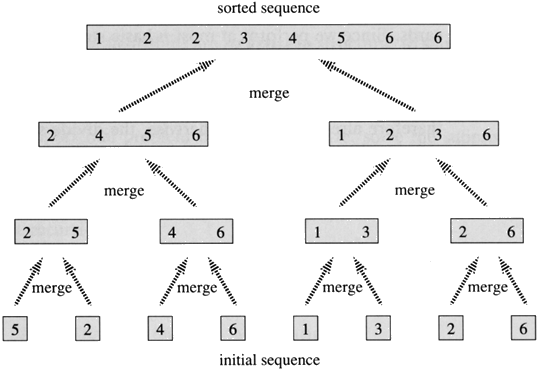

## Python 实现归并排序

### 一、 基本思想
归并排序是一种把多个有序序列合成一个有序序列的排序算法，其平均时间复杂度与快速排序、堆排序都是一样的为O（nlog(n)）。该算法是采用分治法（Divide and Conquer）的一个非常典型的应用。

实现：

（1）初始时，把序列的每个元素看成一个有序子序列，子序列长度为都为1.

（2）把序列两两归并，完成一遍后，每个子序列长度加倍。

（3）对加长的子序列重复上面的操作，最终将得到一个长度为n的有序序列。

这种排序方法称为归并排序。

### 二、图解


### 三、算法实现
```
#!/usr/bin/env python
# Python 实现归并排序


def merge(left, right):
    """
    比较传过来的两个序列 left, right, 返回一个排好的序列
    :param left:
    :param right:
    :return:
    """
    i, j = 0, 0
    result = []
    while i < len(left) and j < len(right):
        if left[i] <= right[j]:
            result.append(left[i])
            i += 1
        else:
            result.append(right[j])
            j += 1
    result += left[i:]
    result += right[j:]
    return result


def merge_sort(arr):
    """
    归并排序算法 Python 算法
    :param arr:
    :return:
    """
    if len(arr) <= 1:  # 将序列不断分为小切片
        return arr
    mid = int(len(arr)/2)
    left = merge_sort(arr[:mid])
    right = merge_sort(arr[mid:])
    # 第一次传过去的是[left=5, right=4], 第二次传过去的是 [left=7, right=4, 5]
    return merge(left, right)

```