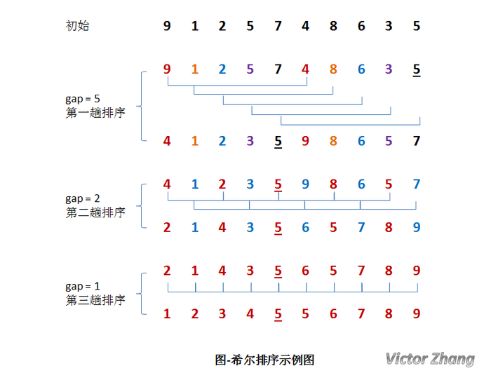

### 1.8 Python 希尔排序

#### 1.3.1 概述

希尔排序(Shell Sort)是插入排序的一种。也称缩小增量排序，是直接插入排序算法的一种更高效的改进版本。

希尔排序是基于插入排序的以下两点性质而提出改进方法的：
    + 插入排序在对几乎已经排好序的数据操作时，效率高，即可以达到线性排序的效率；
    + 但插入排序一般来说是低效的，因为插入排序每次只能将数据移动一位；

该方法的基本思想是：先将整个待排元素序列分割成若干个子序列（由相隔某个“增量”的元素组成的）分别进行直接插入排序，然后依次缩减增量再进行排序，待整个序列中的元素基本有序（增量足够小）时，再对全体元素进行一次直接插入排序。因为直接插入排序在元素基本有序的情况下（接近最好情况），效率是很高的，因此希尔排序在时间效率比直接插入排序有较大提高。
 
#### 1.3.2 算法描述
```text
input: 数组长度为 n，数组下标为 0 到 n − 1
　　inc ← round(n/2)
　　while inc > 0 do:
　　  for i = inc .. n − 1 do:
　　      temp ← a[i]
　　      j ← i
　　      while j ≥ inc and a[j − inc] > temp do:
　　          a[j] ← a[j − inc]
　　          j ← j − inc
　　      a[j] ← temp
　　  inc ← round(inc / 2)

```
#### 1.3.3 语言描述
```text
插入排序的方法进行排序；每次将 gap 折半减小，循环上述操作；当 gap = 1 时，利用直接插入，完成排序。
希尔排序的总体实现应该由三个循环完成：

    第一层循环：将 gap 依次折半，对序列进行分组，直到 gap=1
    第二、三层循环：也即直接插入排序所需要的两次循环。
```

#### 1.3.4 Example

##### 希尔排序图示


##### 动态图描述


#### 1.3.5 算法实现

```python
#!/usr/bin/env python
# Python 实现希尔排序


def shell_sort(arr):
    n = len(arr)
    gap = int(n/2)  # 初始化 gap 值
    # 第一层循环：依次改变 gap 值对列表进行分组
    # 下面：利用直接插入排序的思想对分组元素进行排序
    # range(gap, n) 从 gap 开始
    while gap > 0:
        for i in range(gap, n):
            temp = arr[i]
            j = i
            # 类似插入排序, 当前值与指定步长之前的值比较, 符合条件则交换位置
            while j >= gap and arr[j-gap] > temp:
                arr[j] = arr[j-gap]
                j -= gap
            arr[j] = temp
        # while 循环条件折半
        gap = int(gap/2)
    return arr
```
